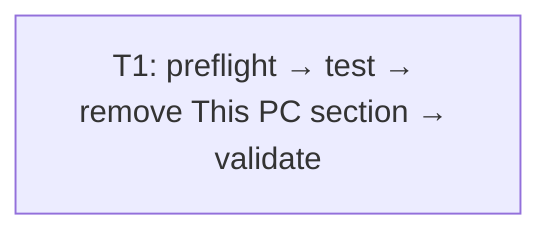

# Remove sidebar This PC section

Remove sidebar This PC heading/shortcuts; retain wrapper, remaining navigation, main This PC view.

## Tickets Flow

## Index

| Ticket ID | Goal | Depends | State | Link |
| --- | --- | --- | --- | --- |
| T1 | Remove only sidebar This PC section without navigation regressions | none | PARTIAL — local commit; runtime/integration pending | [[PLAN_2026_09_09_remove_sidebar_this_pc/T1_remove_this_pc_section|T1: Remove This PC section]] |

## Assumptions

- A1. New isolated branch `plan/remove-sidebar-this-pc` starts from committed main baseline; pre-existing dirty worktrees preserved.
- A2. Main-worktree dependencies/Nix shell reused temporarily for validation; no unrelated source/config changes imported.
- A3. Native validation required XWayland plus validation-only IPv4 dev URL; temporary code/config restored. Full runtime coverage still incomplete.
- A4. Proposed publication remote: `fork`; no push before G3 confirmation. Final cleanup deferred until integration succeeds.

## References

[Scope decisions](GRILL_2026_09_09_remove_sidebar_content/ANSWERS.md) · [HTML plan](PLAN_2026_09_09_remove_sidebar_this_pc.html) · [Review](PLAN_2026_09_09_remove_sidebar_this_pc/REVIEW.md)
